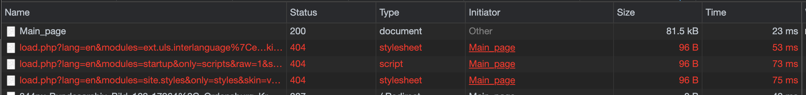

# Project 5: Roll Your Own CDN

Implementation of CDN, including DNS server and HTTP server with cache.

## Team
- Lu Liu HTTP cache
- Tuo Liu DNS server

## DNS server
The DNS server runs on port specified by user, the origin server name is also specified by user. When a DNS request
is received at dns server, the server can use client's IP address to find the CDN server which is most geographically 
close to the client. Only A record is implemented at DNS server, if request contains domain name different from origin
server, no answer is included in the response.

### Improved for final submission
- Use aws region and geolocation to find the best EC2 replicate node
    * All ec2 nodes belong to a particular region, given a client ip, if it belongs to a particular aws region, we can use
    the ec2 node in that region directly. The region is calculated based on open information of ip ranges for each aws region.
    * If a client IP is not in aws, we use API from ipstack.com to find the latitude and longitude, then we can calculate 
    distance from each ec2 nodes to client geolocation. We return the node IP with shortest distance.
- Cache DNS response according to client IP
    * The response of IP is cached for each client so the next dns response from same client can be faster.

## HTTP server
The http server use python http.server to implement the HTTP server portion. A customized request handler is implemented
to deal with GET request only. When a request with path is unseen before, the server will query origin server for content and 
status code, cache the response then return to client. If a request with path is seen in cache, content is returned directly.

The cache implementation is using least recently used strategy for a milestone. We plan to use Most Frequently used strategy
for latter part of the project. The frequency of the path is loaded from the pageview.csv which has the frequency information.
This information is used to bootstrap the cache frequency. As requests are received at the HTTP server, it will update its own
frequency lookup table.

### Improved for final submission
- LRU with disk, this cache use disk as storage for content, the keys are stored in memory. The keys and file are evicted according to usage. Least used key/file is evicted.
- LRU, this is similar to LRU with disk except content is stored in memoery.
- LFU, this use both disk and memory to store content. When a key is not in memory, it try to read from file first. If no file exists, it fetch from origin and store on file. When key is evicted according to frequency in pageviews.csv, the key and corresponding file is deleted. 

## Example Commands
```shell
./deployCDN -p 40001 -o cs5700cdnorigin.ccs.neu.edu -n cs5700cdn.example.com -u liutuo -i ~/.ssh/id_rsa
./runCDN -p 40001 -o cs5700cdnorigin.ccs.neu.edu -n cs5700cdn.example.com -u liutuo -i ~/.ssh/id_rsa
./stopCDN -p 40001 -o cs5700cdnorigin.ccs.neu.edu -n cs5700cdn.example.com -u liutuo -i ~/.ssh/id_rsa
```

## Evaluation

### DNS server
First query
```shell
;; ANSWER SECTION:
cs5700cdn.example.com.	300	IN	A	50.18.189.64

;; Query time: 362 msec
;; SERVER: 129.10.117.187#40001(129.10.117.187)
;; WHEN: Mon Apr 19 22:47:49 PDT 2021
;; MSG SIZE  rcvd: 55
```

Second query
```shell
;; ANSWER SECTION:
cs5700cdn.example.com.	300	IN	A	50.18.189.64

;; Query time: 94 msec
;; SERVER: 129.10.117.187#40001(129.10.117.187)
;; WHEN: Mon Apr 19 22:47:58 PDT 2021
;; MSG SIZE  rcvd: 55
```

From the time we can see the second query from same client is much faster since it is cached in memory.

Then we use pingCDN to find the time for the test client to get main page from each ec2 node. 
```shell
Get main page from ec2-54-159-99-25.compute-1.amazonaws.com 0.340211
Get main page from ec2-50-18-189-64.us-west-1.compute.amazonaws.com 0.066633
Get main page from ec2-18-229-54-5.sa-east-1.compute.amazonaws.com 1.207830
Get main page from ec2-13-244-183-11.af-south-1.compute.amazonaws.com 1.424373
Get main page from ec2-13-36-115-83.eu-west-3.compute.amazonaws.com 0.809274
Get main page from ec2-13-51-89-160.eu-north-1.compute.amazonaws.com 0.809332
Get main page from ec2-65-1-183-44.ap-south-1.compute.amazonaws.com 1.420136
Get main page from ec2-13-208-85-51.ap-northeast-3.compute.amazonaws.com 0.809876
Get main page from ec2-54-79-190-216.ap-southeast-2.compute.amazonaws.com 0.805538
```
The DNS server returns 50.18.189.64 which is ec2-50-18-189-64.us-west-1.compute.amazonaws.com.
It is the fastest for the test client. This shows the geolocation algorithm for finding the best node works.

### HTTP server
We implemented three cache, LRU with disk, LRU and LFU. As we encounter memory errors when use in memory cache on ec2 nodes.
we decided to use LRU with disk in the end. For this implementation, content is stored on disk while keys are stored in memory.
The evaluation is done on localhost with Mage_page.

LRU with disk
- First time fetch 
- Second time fetch 
LRU
- First time fetch 
- Second time fetch 
LFU
- First time fetch 
- Second time fetch, content exists in memory 
- Server rebooted, content exists on disk 


From the result shown above, all cache can improve load speed significantly, on disk content is slower compared to in memory cache, but still in reasonable time.
